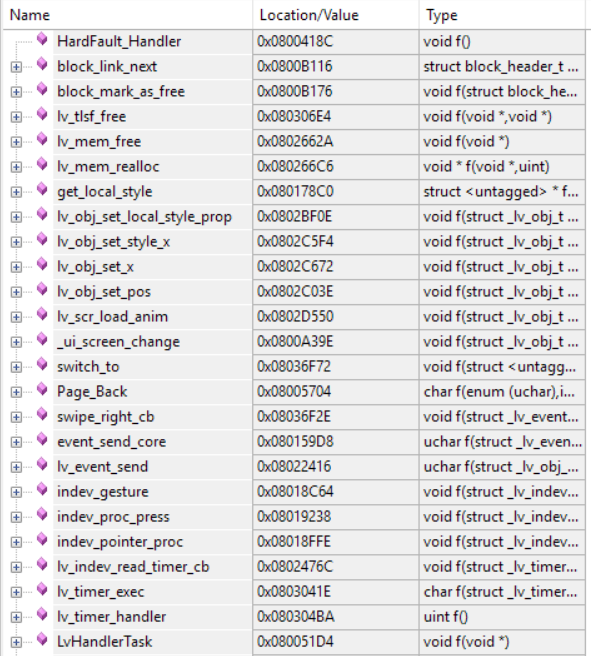
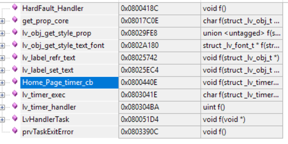

### 问题1：Bug Report: HardFault on vTaskDelete / Idle Task uxListRemove

###### 现象

程序执行到 `HardwareInitTask` 末尾的 `vTaskDelete(NULL)` 后：

1. 最初表现为程序**卡住不动**（停在 `configASSERT` 死循环）
2. 增大栈后变为**HardFault**，Call Stack 如下：
   ```
   HardFault_Handler
   uxListRemove
   prvCheckTasksWaitingTermination
   prvIdleTask
   ```

###### 直接原因

`HardwareInitTask` **栈溢出（Stack Overflow）**，溢出部分覆盖了该任务的 TCB（Task Control Block）中的链表指针。当 `vTaskDelete(NULL)` 被调用后，**Idle 任务**负责回收已删除任务的内存；在 `prvCheckTasksWaitingTermination` -> `uxListRemove` 时访问了被损坏的链表节点，触发 HardFault。

###### 为什么栈会溢出

- `HardwareInitTask` 原栈大小仅 `128 * 10 = 1280` 字节
- 该任务内部执行了大量深层调用：
  - `LCD_Init()` / `LCD_Fill()` / `LCD_ShowString()`
  - `lv_init()`
  - `lv_port_disp_init()`
  - `lv_port_indev_init()`
  - `ui_init()`
- 这些函数层层嵌套，加上局部变量，远超 1280 字节栈空间
- 同时 `LvHandlerTask` 栈也仅有 1280 字节，跑 `lv_task_handler()` 同样存在溢出风险

##### 修复措施

###### 1. 增大任务栈大小

**`user_TasksInit.c`**

```c
// HardwareInitTask: 1280 bytes -> 5120 bytes
const osThreadAttr_t HardwareInitTask_attributes = {
  .name = "HardwareInitTask",
  .stack_size = 128 * 40,
  .priority = (osPriority_t) osPriorityNormal+1,
};

// LvHandlerTask: 1280 bytes -> 3840 bytes
const osThreadAttr_t LvHandlerTask_attributes = {
  .name = "LvHandlerTask",
  .stack_size = 128 * 30,
  .priority = (osPriority_t) osPriorityNormal,
};
```

###### 2. 增大 FreeRTOS 堆大小

**`FreeRTOSConfig.h`**

```c
// 15KB -> 32KB（LVGL 需要大量动态内存）
#define configTOTAL_HEAP_SIZE  ((size_t)32768)
```

###### 3. 启用栈溢出检测

**`FreeRTOSConfig.h`**

```c
#define configCHECK_FOR_STACK_OVERFLOW  2
```

启用后，若发生栈溢出会进入 `vApplicationStackOverflowHook`，可在此处打断点快速定位问题任务。

###### 4. 建议：添加栈溢出 Hook（可选）

在 `freertos.c` 中添加：

```c
void vApplicationStackOverflowHook(TaskHandle_t xTask, char *pcTaskName)
{
    (void)xTask;
    (void)pcTaskName;
    taskDISABLE_INTERRUPTS();
    for(;;); // 在此打断点，查看 pcTaskName 定位爆栈任务
}
```

##### 调试复盘

| 阶段   | 现象                          | 分析                                                                        |
| ------ | ----------------------------- | --------------------------------------------------------------------------- |
| 第一次 | `configASSERT` 死循环       | TCB 被溢出数据破坏，`ucStaticallyAllocated` 字段非法，断言失败            |
| 第二次 | HardFault 在 `uxListRemove` | 增大栈后不再断言，但之前溢出已导致链表节点损坏，Idle 任务清理时访问非法地址 |

##### 总结

FreeRTOS 任务栈溢出不会立刻报错，而是**静默破坏相邻内存**（通常是 TCB 或堆管理结构），症状可能在完全无关的地方（如 `vTaskDelete`、`Idle 任务`、`uxListRemove`）才暴露出来。因此：

- 涉及 LVGL、文件系统、网络等复杂初始化时，任务栈建议至少 **4KB ~ 8KB**
- 务必开启 `configCHECK_FOR_STACK_OVERFLOW`
- 利用 `uxTaskGetStackHighWaterMark()` 监控各任务实际栈使用峰值

### 问题2：Bug Report: 点击计算器后屏幕卡死 — LVGL 内存池耗尽

###### 现象

点击 MenuPage 的 Calculator 磁贴后，屏幕画面卡住不动。但闪灯程序（defaultTask）仍在执行，说明 FreeRTOS 调度器正常运行。Debug 发现程序卡死在 `lv_label.c` 第 135 行。

###### 直接原因

`lv_label.c:133-135`：

```c
label->text = lv_mem_alloc(len);     // 内存分配失败，返回 NULL
LV_ASSERT_MALLOC(label->text);       // 触发断言 → while(1); 死循环
```

LVGL 内置内存池（20KB）在创建 CalcPage 时耗尽。`lv_mem_alloc()` 返回 NULL，`LV_ASSERT_MALLOC` 展开为 `LV_ASSERT_MSG(p != NULL, "Out of memory")`，最终执行 `LV_ASSERT_HANDLER` → `while(1);` 永久卡死。

###### 为什么内存会耗尽

1. **三屏共存** — 页面切换动画期间（250ms），旧页面屏幕对象延迟删除，同时存在：

   - HomePage（persistent，~40 个 LVGL 对象）永久存活
   - MenuPage（~15 个对象）已入删除队列但尚未释放
   - CalcPage（~46 个对象）刚创建完成
   - 合计约 **100 个对象**，超过 20KB 内存池容量
2. **CalcPage 的 20 个按钮标签** — 每个 `lv_label_set_text()` 都会调用 `lv_mem_alloc()` 在堆上分配文本副本（即使源文本是字符串字面量）
3. **HomePage 1 秒定时器造成的内存碎片** — `update_timer_cb` 每秒对 time/date/battery/HR/steps/temp 等标签执行 `lv_label_set_text()` 或 `lv_label_set_text_fmt()`，每次调用内部先 `lv_mem_free()` 旧文本再 `lv_mem_alloc()` 新文本。LVGL 内置分配器合并相邻空闲块能力有限，长期运行后碎片化严重。

###### 修复措施

**1. 常量字符串标签改用 `lv_label_set_text_static()`**

影响 7 个文件，约 40 个标签：

| 文件                 | 修改的标签                                       |
| -------------------- | ------------------------------------------------ |
| `ui_CalcPage.c`    | 20 个按钮标签 + 标题 "Calculator"                |
| `ui_HomePage.c`    | Dock 卡片图标/文本、Complications 图标、亮度标题 |
| `ui_MenuPage.c`    | 标题 "Apps"                                      |
| `ui_AlarmPage.c`   | OK/Cancel 按钮、标题 "Alarm"                     |
| `ui_CompassPage.c` | N/S/E/W 方位标签、标题 "Compass"                 |
| `ui_HRPage.c`      | 心形图标、BPM 单位、标题 "Heart Rate"            |
| `ui_CardPage.c`    | 磁贴图标、单位标签                               |
| `ui_SetPage.c`     | 分区标题                                         |
| `ui_common.c`      | 返回按钮图标                                     |

`lv_label_set_text_static()` 直接存储字符串指针（`label->text = (char *)text`），不调用 `lv_mem_alloc()`，标记 `static_txt = 1`，销毁时也不会 `lv_mem_free()`。适用于所有字符串字面量/常量。

**2. 移除 CalcPage 冗余的 `lv_label_set_text` 调用**

`CalcPage_Create` 中先在 line 224 设置 display_label 为 "0"，随后 line 231 `calc_reset()` → `update_display()` 又设置一次。删除第一次调用。

**3. 增大 LVGL 内存池**

`lv_conf.h`：`LV_MEM_SIZE` 从 `20U * 1024U` → `32U * 1024U`，为峰值使用提供额外安全余量。

###### 参考代码变更

```c
// 修改前（动态分配，每次消耗堆内存）
lv_label_set_text(label, "Calculator");

// 修改后（只存指针，零堆开销）
lv_label_set_text_static(label, "Calculator");
```

###### 总结

- LVGL 页面创建期间，旧屏幕的延迟删除意味着峰值对象数 = 常驻页面 + 旧页面 + 新页面
- **所有固定文本的标签应使用 `lv_label_set_text_static()`**，这是 LVGL 官方推荐做法
- `lv_label_set_text_fmt()` 无法使用 static，应尽量减少调用频率
- 20KB 内存池对于复杂 UI（100+ 对象）偏小，建议 32KB 起步
- `LV_ASSERT_HANDLER` 为 `while(1);` 时，内存耗尽表现为"卡死"而非明确的错误信息，调试时应优先检查 `lv_mem_alloc()` 返回值

### 问题3：Bug Report: 页面切换时 HardFault — LVGL 内存池损坏（Use-after-free）

###### 现象

从 HomePage 滑入 SensorPage 正常，但从 SensorPage 右滑返回 HomePage 时触发 HardFault。两种崩溃场景：

1. **切换时崩溃**：`Page_Back` → `switch_to` → `lv_scr_load_anim` → `lv_obj_set_pos` → `get_local_style` → `lv_mem_realloc` → `lv_mem_free` → `lv_tlsf_free` → `block_mark_as_free` → `block_link_next` → `HardFault`
2. **返回后定时器崩溃**：`LvHandlerTask` → `lv_timer_handler` → `Home_Page_timer_cb` → `lv_label_set_text` → `lv_label_refr_text` → `lv_obj_get_style_text_font` → `get_prop_core` → `HardFault`，栈底出现 `prvTaskExitError`

   

   

###### 直接原因

`lv_scr_load_anim` 执行动画期间，**动画引擎持续引用旧屏幕对象**。但 `ui_SensorPage_deinit` 中 `lv_obj_del(ui_SensorPage)` 立即释放了旧屏幕，导致动画系统访问已释放内存，破坏整个 TLSF 内存池链表头。后续任何内存操作（释放/重分配）遍历到已损坏的链表节点即触发 HardFault。

栈底 `prvTaskExitError` 表明 `LvHandlerTask` 栈也曾溢出（3KB 不够），溢出数据进一步破坏了内存池或全局变量。

###### 为什么之前没发现

1. `PageManager` 原使用 `lv_scr_load`（无动画），切换时旧屏幕直接替换，不存在动画期间的引用问题
2. 引入 `lv_scr_load_anim` 后未同步修改释放策略，`deinit` 仍按旧逻辑立即 `lv_obj_del`
3. 内存池 20KB 长期紧张，微小破坏即引发连锁崩溃

###### 修复措施

**1. 延迟删除旧屏幕（PageManager.c）**

动画结束后再删除旧屏幕对象，避免动画期间访问已释放内存：

```c
static void delayed_delete_cb(lv_timer_t *t)
{
    lv_obj_t **scr_ptr = (lv_obj_t **)(t->user_data);
    if(*scr_ptr) {
        lv_obj_del(*scr_ptr);
        *scr_ptr = NULL;        // 释放后必须置 NULL
    }
    lv_timer_del(t);
}

static void switch_to(Page_t *old_page, Page_t *new_page, ...)
{
    if (old_page != NULL && old_page != stack.home_page)
        old_page->deinit();     // deinit 只删定时器，不删屏幕对象
    if (new_page != stack.home_page)
        new_page->init();

    lv_obj_t *old_scr = (old_page != NULL && old_page != stack.home_page)
                        ? *old_page->page_obj : NULL;

    lv_scr_load_anim(*new_page->page_obj, fademode, spd, delay, false);

    if (old_scr != NULL) {
        lv_timer_t *del_timer = lv_timer_create(
            delayed_delete_cb,
            spd + delay + 50,       // 动画时间 + 保险余量
            old_page->page_obj      // 传入指针地址，回调里置 NULL
        );
        lv_timer_set_repeat_count(del_timer, 1);
    }
}
```

**2. 修改所有 deinit，不再手动 `lv_obj_del`**

屏幕对象由延迟删除机制负责，deinit 只清理定时器和外部资源：

```c
void ui_SensorPage_deinit(void)
{
    ui_SensorPage = NULL;       // 只清指针，不删对象
    temp_label = NULL;
    humi_label = NULL;
    pressure_label = NULL;
    altitude_label = NULL;

    if(ui_SensorPageTimer != NULL) {
        lv_timer_del(ui_SensorPageTimer);
        ui_SensorPageTimer = NULL;
    }
}
```

`ui_Home_Page_deinit` 同样处理。

**3. 增大 LvHandlerTask 栈**

`user_TasksInit.c`：`stack_size` 从 `128 * 24` → `128 * 48`（3KB → 6KB）

**4. 增大 LVGL 内存池**

`lv_conf.h`：`LV_MEM_SIZE` 从 `20U * 1024U` → `48U * 1024U`

###### 调试复盘

| 阶段     | 现象                                        | 分析                                                                                |
| -------- | ------------------------------------------- | ----------------------------------------------------------------------------------- |
| 第一次   | 切换时 HardFault 在 `block_link_next`     | `lv_obj_del` 在动画期间释放旧屏幕，动画引擎访问野指针，TLSF 链表头损坏            |
| 第二次   | 返回后定时器崩溃，栈底 `prvTaskExitError` | 内存池已损坏，后续 `lv_label_set_text` 再次崩溃；LvHandlerTask 栈溢出也贡献了破坏 |
| 增大栈后 | 仍崩溃                                      | 栈溢出不是唯一原因，Use-after-free 已永久性破坏内存池结构                           |

###### 总结

- `lv_scr_load_anim` + `lv_obj_del` 是**致命组合**：动画引擎在 `spd+delay` 毫秒内持续引用旧屏幕，立即释放等于自毁
- 解决方案：**延迟删除**（动画结束后）或**禁用动画**（直接用 `lv_scr_load`）
- `prvTaskExitError` 出现在栈回溯中是 FreeRTOS 栈溢出的典型标志，即使修改了代码也要增大栈
- 内存池损坏是**延迟爆发**的：破坏发生在 A 时刻，崩溃出现在 B 时刻，容易误判为 B 处代码有问题
